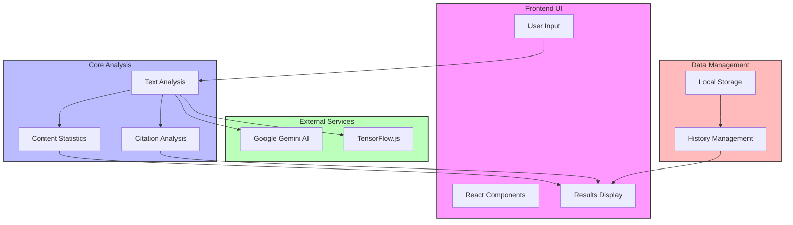
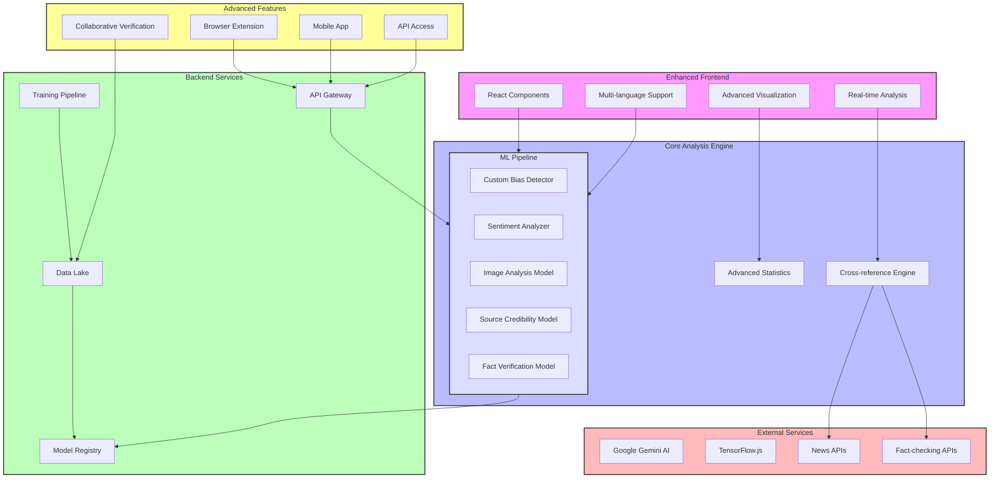

# Architecture Documentation

## Current Implementation

```mermaid
flowchart TB
    subgraph UI["Frontend UI"]
        RC["React Components"]
        Input["User Input"]
        Display["Results Display"]
    end

    subgraph Core["Core Analysis"]
        TextAnalysis["Text Analysis"]
        Stats["Content Statistics"]
        Citations["Citation Analysis"]
    end

    subgraph External["External Services"]
        Gemini["Google Gemini AI"]
        TF["TensorFlow.js"]
    end

    subgraph Data["Data Management"]
        Storage["Local Storage"]
        History["History Management"]
    end

    Input --> TextAnalysis
    TextAnalysis --> Gemini
    TextAnalysis --> TF
    TextAnalysis --> Stats
    TextAnalysis --> Citations
    Stats --> Display
    Citations --> Display
    Storage --> History
    History --> Display

    style UI fill:#f9f,stroke:#333,stroke-width:2px
    style Core fill:#bbf,stroke:#333,stroke-width:2px
    style External fill:#bfb,stroke:#333,stroke-width:2px
    style Data fill:#fbb,stroke:#333,stroke-width:2px
```

## Future Implementation

```mermaid
flowchart TB
    subgraph UI["Enhanced Frontend"]
        RC["React Components"]
        Viz["Advanced Visualization"]
        RTA["Real-time Analysis"]
        Lang["Multi-language Support"]
    end

    subgraph Core["Core Analysis Engine"]
        subgraph ML["ML Pipeline"]
            Bias["Custom Bias Detector"]
            Sentiment["Sentiment Analyzer"]
            Image["Image Analysis Model"]
            Source["Source Credibility Model"]
            Facts["Fact Verification Model"]
        end
        Stats["Advanced Statistics"]
        CrossRef["Cross-reference Engine"]
    end

    subgraph Backend["Backend Services"]
        API["API Gateway"]
        Registry["Model Registry"]
        Training["Training Pipeline"]
        DataLake["Data Lake"]
    end

    subgraph External["External Services"]
        Gemini["Google Gemini AI"]
        TF["TensorFlow.js"]
        News["News APIs"]
        FactCheck["Fact-checking APIs"]
    end

    subgraph Features["Advanced Features"]
        Extension["Browser Extension"]
        Mobile["Mobile App"]
        PublicAPI["API Access"]
        Collab["Collaborative Verification"]
    end

    RC --> ML
    ML --> Registry
    Training --> DataLake
    DataLake --> Registry
    API --> ML
    Viz --> Stats
    RTA --> CrossRef
    CrossRef --> News
    CrossRef --> FactCheck
    Lang --> ML
    Extension --> API
    Mobile --> API
    Collab --> DataLake
    PublicAPI --> API

    style UI fill:#f9f,stroke:#333,stroke-width:2px
    style Core fill:#bbf,stroke:#333,stroke-width:2px
    style Backend fill:#bfb,stroke:#333,stroke-width:2px
    style External fill:#fbb,stroke:#333,stroke-width:2px
    style Features fill:#ff9,stroke:#333,stroke-width:2px
    style ML fill:#ddf,stroke:#333,stroke-width:2px
```