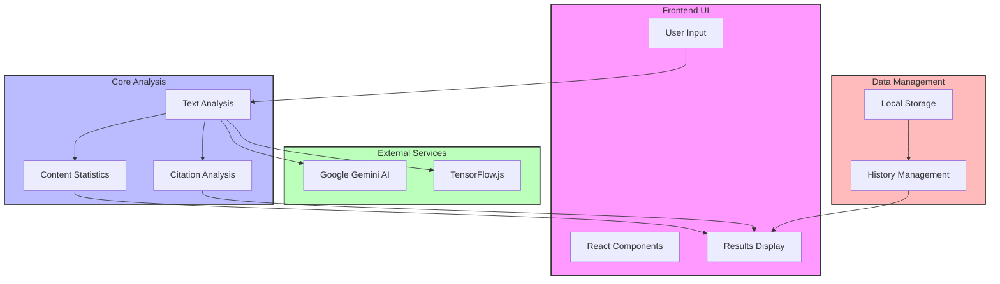
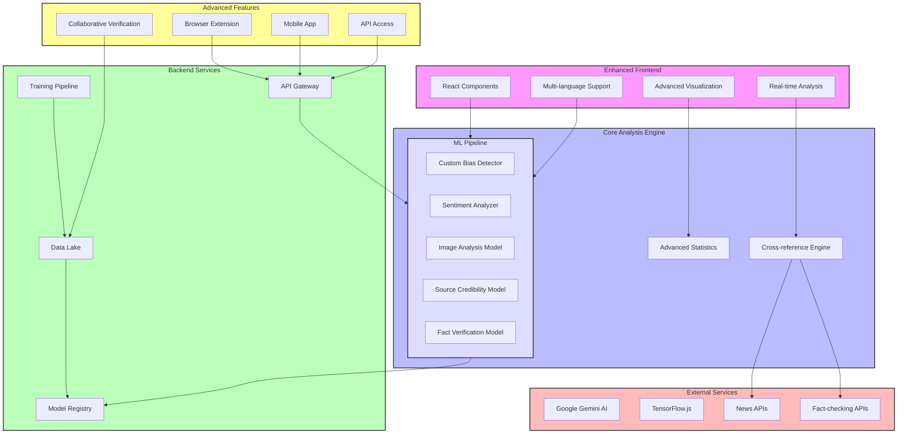
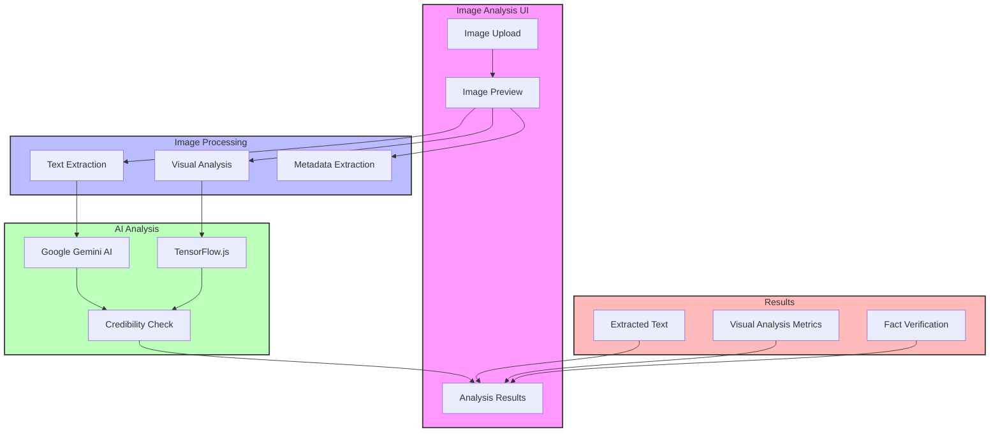
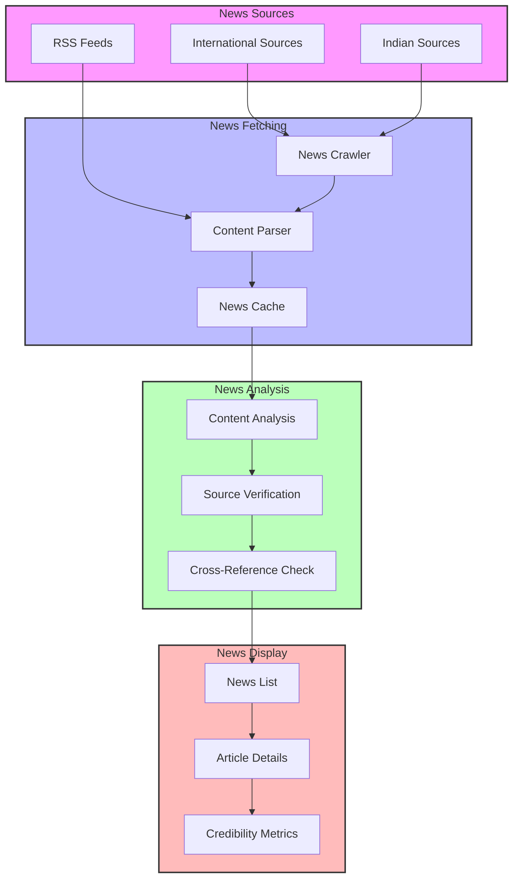
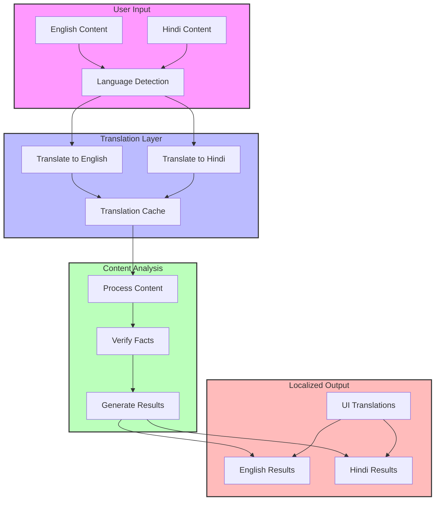

# Architecture Documentation

## Current Implementation

## Future Implementation

## Image Analysis Flow

## News Analysis Flow

## Multilingual Support Flow

## Component Descriptions

### Image Analysis Components
- **Upload & Preview**: Handles image input and preview
- **OCR Processing**: Extracts text from images
- **Visual Analysis**: Analyzes image authenticity
- **Metadata Extraction**: Gets image metadata
- **AI Analysis**: Uses Gemini AI for deep analysis

### News Analysis Components
- **News Sources**: Multiple international and Indian sources
- **Content Parser**: Processes news articles
- **Source Verification**: Checks source credibility
- **Cross-Reference**: Verifies against other sources
- **Display**: Shows news with credibility metrics

### Multilingual Support
- **Language Detection**: Auto-detects content language
- **Translation Layer**: Handles EN-HI translations
- **Content Analysis**: Language-specific processing
- **Localized Output**: Results in both languages
- **UI Translations**: Fully bilingual interface

## Data Flow

1. **Image Analysis Flow**
   - Image upload and validation
   - Text extraction and processing
   - Visual analysis and fact verification
   - Results generation and display

2. **News Analysis Flow**
   - Fetch from multiple sources
   - Parse and analyze content
   - Verify source credibility
   - Display with metrics

3. **Multilingual Flow**
   - Detect input language
   - Translate if needed
   - Process in primary language
   - Return localized results

## Security Considerations

- Secure image upload and processing
- API rate limiting for news sources
- Translation API security
- Cross-origin resource protection
- Data privacy in multilingual processing